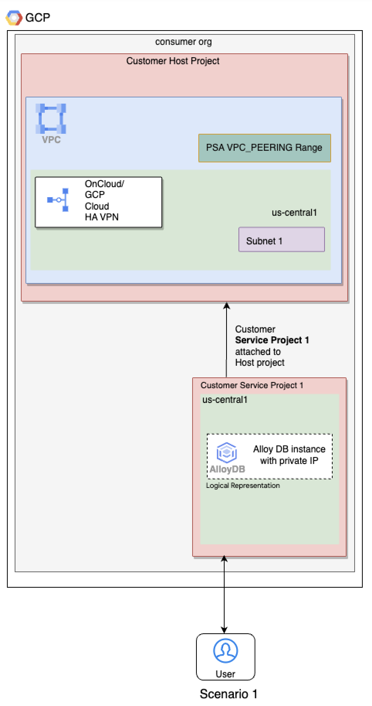
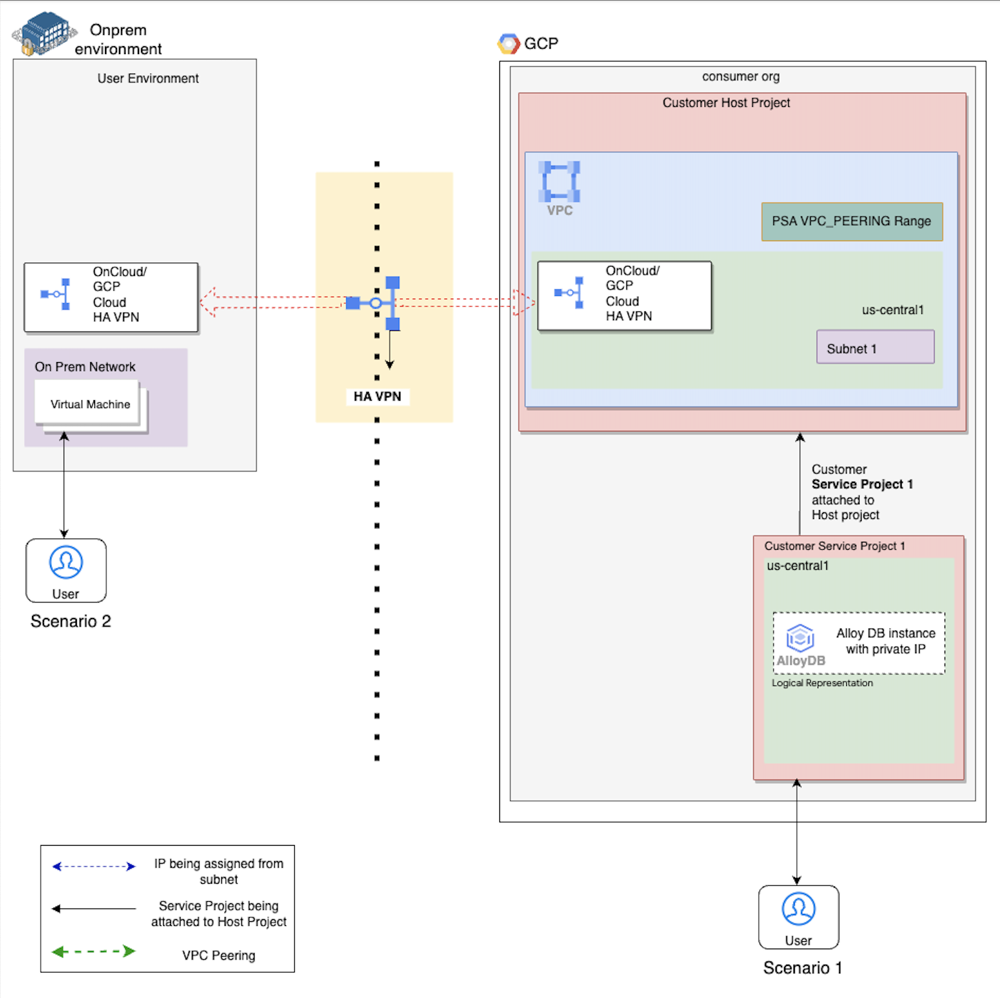
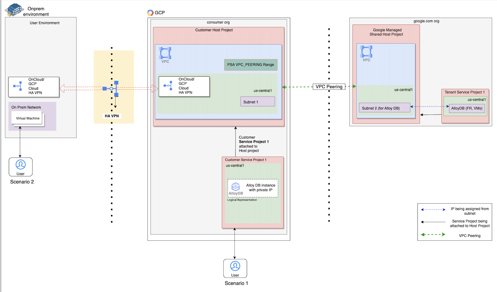

# Create an AlloyDB Instance with Secure Private Connectivity Through Private Service Access (PSA) Accessed Using Google Compute Engine

**On this page**

  1. [Objectives](#objectives)

  2. [Architecture](#architecture)

  3. [Request flow](#request-flow)

  4. [Architecture Components](#architecture-components)

  5. [Deploy the solution](#deploy-the-solution)

  6. [Prerequisites](#prerequisites)

  7. [Deploy through “terraform-cli”](#deploy-through-terraform-cli)

  8. [Optional : Delete the deployment](#optional-delete-the-deployment)

  9. [Submit feedback](#submit-feedback)

---

This guide is designed to provide a clear understanding and assist database administrators, cloud architects, and cloud engineers in optimizing the deployment process. By utilizing simplified networking within the Google Cloud platform, it automates the extensive setup required for leveraging AlloyDB. The guide assumes familiarity with cloud computing concepts, Terraform, AlloyDB, Virtual Private Cloud (VPC), and Private Service Access (PSA).

This guide provides instructions on using the **cloudnetworking-config-solutions** repository on GitHub to automate establishing your AlloyDB cluster on Google Cloud. Terraform enables you to formalize your infrastructure as code, which facilitates deployment and ensures consistency, even in complex architectures.

### Objectives

This solution guide helps you do the following :

* Set up VPC, Subnets and private connectivity using PSA
* Learn about AlloyDB instance and configurations
* Create an AlloyDB instance with secure private connectivity through PSA
* Create a GCE instance
* Perform CRUD operations from a GCE instance to an AlloyDB instance using the private IP of the AlloyDB instance

### Architecture

This solution deploys an AlloyDB instance and a GCE instance.The solution also creates all the necessary components — such as VPC, subnets, and firewall rules \- required by the AlloyDB and GCE instance.

It covers two scenarios:

* **Scenario 1: Simple Connectivity Within a VPC:** Suitable for deployments entirely within the Google Cloud environment.

  

* **Scenario 2: Connectivity with Cloud HA VPN:** Ideal for connecting your AlloyDB cluster to on-premises or other cloud networks using Google Cloud High Availability Virtual Private Network (HA VPN).

  


### Request flow

The following illustrates the request processing flow for both scenarios:

1. **Scenario 1:** Within the Google Cloud project, a user initiates a request from a GCE instance. The GCE instance receives the request and routes it to the AlloyDB instance. Both the AlloyDB and GCE instances utilize the same VPC network.

2. **Scenario 2:** A user initiates a request from a virtual machine (VM) instance operating outside the Google Cloud project. The on-premises location (or alternative location) establishes a connection to the Google Cloud network (VPC) through Cloud High Availability (HA) VPN. The VM instance receives the request and routes it via the Cloud HA VPN to the Google Cloud network (VPC). The request is then forwarded to the AlloyDB instance using its private IP address.

## **Architecture Components**

Following is a holistic diagram encompassing both the scenarios covered by the solution.

The diagram depicts three environments: the on-premises environment (left box), the Google Cloud consumer organization (middle box), and the Google-managed Google organization (right box).

  

Cloud HA VPN facilitates a secure and reliable connection between the on-premises environment and the Google Cloud consumer organization.

In the context of Google Cloud, the customer-managed Google Cloud organization is the primary entity where customer-managed Google Cloud resources are created. The diagram illustrates three Google Cloud projects, one of which is the customer host project. This project is responsible for creating and overseeing Virtual Private Cloud (VPC) networks. Within the customer host project, a VPC network is established, encompassing subnets represented by green boxes. One subnet resides in the us-central1 region. To facilitate private connectivity between the VPC network created in the customer host project and the VPC network of the Google-managed host project, a PSA VPC\_Peering range is configured within the VPC network. The Cloud HA VPN routers are positioned within the subnet and establish the connection between the on-premises network and the VPC network.

Customer Service Project 1 is attached to the Customer Host Project. This attachment uses the host project's networks.

* **Customer Service Project 1** uses the PSA VPC\_Peering range for the AlloyDB instance.

The diagram describes the working components of the google cloud involved when using the Cloud HA VPN to establish communication with an on premise environment or other VPC network running in another GCP project.
The solution template helps in automating the creation, configuration of HA VPN tunnels, gateways, compute routers etc resources and helps in establishing communication of VPC network with another network which could be running in google cloud or outside of google cloud.

## **Deploy the solution**

This section guides you through the process of deploying the solution.

### **Prerequisites**

To use this configuration solution, ensure the following are installed:

1. **Terraform** : modules are for use with Terraform 1.8+ and tested using Terraform 1.8+. Choose and install the preferred Terraform binary from [here](https://releases.hashicorp.com/terraform/).
2. **gcloud SDK** : install gcloud SDK from [here](https://cloud.google.com/sdk/docs/install) to authenticate to Google Cloud while running Terraform.

####

### Deploy through terraform-cli

1. **Clone the** cloudnetworking-config-solutions repository repository**:**
    ```
    git clone https://github.com/GoogleCloudPlatform/cloudnetworking-config-solutions.git
    ```

2. Navigate to **cloudnetworking-config-solutions** folder and update the files containing the configuration values
   * **00-bootstrap stage**
     * Update configuration/bootstrap.tfvars **\-** update the google cloud project IDs and the user IDs/groups in the tfvars.

        ```
        bootstrap_project_id                  = "your-project-id"
        network_hostproject_id                = "your-project-id"
        network_serviceproject_id             = "your-project-id"
        organization_stage_administrator      = ["user:user-example@example.com"]
        networking_stage_administrator        = ["user:user-example@example.com"]
        security_stage_administrator          = ["user:user-example@example.com"]
        producer_stage_administrator          = ["user:user-example@example.com"]
        networking_manual_stage_administrator = ["user:user-example@example.com"]
        consumer_stage_administrator          = ["user:user-example@example.com"]
        ```

   * **01-organisation stage**
     * Update configuration/organization.tfvars \- update the google cloud project ID and the list of the APIs to enable for the AlloyDB cluster.

        ```
        activate_api_identities = {
          "project-01" = {
            project_id = "your-project-id",
            activate_apis = [
              "servicenetworking.googleapis.com",
              "alloydb.googleapis.com",
              "iam.googleapis.com",
              "compute.googleapis.com",
              ],
          },
        }
        ```

   * **02-networking stage**
     * Update configuration/networking.tfvars \- update the Google Cloud Project ID and the parameters for additional resources such as VPC, subnet, and NAT as outlined below.

        ```
        project_id  = "your-project-id",
        region      = "us-central1"

        ## VPC input variables
        network_name = "CNCS_VPC"
        subnets = [
          {
            ip_cidr_range = "10.0.0.0/24"
            name          = "CNCS_VPC_Subnet_1"
            region        = "us-central1-a"
          }
        ]
        psa_range_name    = range1
        psa_range         = "10.0.64.0/20"

        ## PSC/Service Connectivity Variables
        create_scp_policy  = false

        ## Cloud Nat input variables
        create_nat = true
        ## Cloud HA VPN input variables
        create_havpn = false
        ```

   * **03-security stage**
     * Update configuration/security/gce.tfvars file \- update the Google Cloud Project ID. This will facilitate the creation of essential firewall rules, granting GCE instances the ability to transmit traffic to AlloyDB instances.

        ```
        project_id = "your-project-id"
        network    = "CNCS_VPC"
        ingress_rules = [
          {
            name        = "allow-ssh-custom-ranges"
            description = "Allow SSH access from specific networks"
            priority    = 1000
            source_ranges = [
              "", # Source ranges such as "192.168.1.0/24" or "10.0.0.0/8"
            ]
            target_tags = ["ssh-allowed", "https-allowed"]
            allow = [{
              protocol = "tcp"
              ports    = ["22", "443"]
            }]
          }
        ]
        ```

      * Update configuration/security/alloydb.tfvars file \- update the Google Cloud Project ID. This will facilitate the creation of essential firewall rules, granting GCE instances the ability to transmit traffic to AlloyDB instances.

        ```
        project_id   = "your-project-id",
        network      = "CNCS_VPC"
        egress_rules = {
          allow-egress-alloydb = {
            deny = false
            rules = [{
              protocol = "tcp"
              ports    = ["5432"]
            }]
          }
        }
        ```
        **NOTE** : Before moving forward, please delete the security/mrc.tfvars and security/cloudsql.tfvars files as our CUJ only involves AlloyDB and GCE.
  * **04-producer stage**
      * Update the execution/04-producer/AlloyDB/config/instance.yaml.example file and rename it to instance.yaml
        ```
        cluster_id: cncs-alloydb-cluster1
        cluster_display_name: cncs-alloydb-demo-cluster1
        project_id: "your-project-id"
        region: us-central1
        network_id: projects/<your-project-id>/global/networks/CNCS_VPC
        allocated_ip_range: range1
        primary_instance:
          instance_id : cncs-alloydb-instance1
          display_name : cncs-alloydb-demo-instance1
          instance_type : PRIMARY
          machine_cpu_count : 2
          database_flags : null
        read_pool_instance : null
        automated_backup_policy : null
        ```

   * **06-consumer stage**
     * Update the execution/06-consumer/GCE/config/instance.yaml.example file and rename it to instance.yaml
        ```
        project_id: your-project-id
        name: CNCS-GCE
        region : us-central1
        zone: us-central1-a
        image: ubuntu-os-cloud/ubuntu-2204-lts
        network: projects/<your-project-id>/global/networks/CNCS_VPC
        subnetwork: projects/<your-project-id>/regions/us-central1/subnetworks/CNCS_VPC_Subnet_1
        ```

3. **Execute the terraform script**
   You can now deploy the stages individually using **run.sh** or you can deploy all the stages automatically using the [run.sh](http://run.sh) file. Navigate to the execution/ directory and run this command to run the automatic deployment using **run.sh .**

    ```
    ./run.sh -s all -t init-apply-auto-approve
    or
    ./run.sh --stage all --tfcommand init-apply-auto-approve
    ```

4. **Verify Cluster Creation:**
   Once the deployment is complete, navigate to the AlloyDB section in the Google Cloud Console to confirm that your cluster has been successfully created.
5. **Connect to Your Google Compute Instance & AlloyDB Instance:**
   * **Compute Instance**
     * You can login into your compute instance , refer [link](https://cloud.google.com/compute/docs/connect/standard-ssh)

        ```
        gcloud compute ssh --project=<your-project-id> --zone=us-central1-a CNCS-GCE
        ```

   * **AlloyDB Instance**
     * You can connect to your alloydb instance from the GCE instance, refer [link](https://cloud.google.com/alloydb/docs/connect-psql)

        ```
        gcloud compute ssh --project=<your-project-id> --zone=us-central1-a CNCS-GCE


        psql -h IP_ADDRESS -U USERNAME
        ```

* `IP_ADDRESS` \- Is the private IP address of your Alloydb instance
* `USERNAME`   \- default value `postgres` .

## **Optional-Delete the deployment**

1. In Cloud Shell or in your terminal, make sure that the current working directory is $HOME/cloudshell\_open/\<Folder-name\>/execution. If it isn't, go to that directory.
2. Remove the resources that were provisioned by the solution guide:

    ```
    ./run.sh -s all -t init-destroy-auto-approve
    ```

Terraform displays a list of the resources that will be destroyed.

3. When you're prompted to perform the actions, enter yes.

## **Submit feedback**

To troubleshoot errors, check Terraform's logs and output.

To submit feedback, do the following:

* If you're looking for assistance with streamlining network configuration automation for a comparable use case, feel free to submit an issue on the [GitHub repository](https://github.com/GoogleCloudPlatform/cloudnetworking-config-solutions/issues).
* For unmodified Terraform code, create issues in the [GitHub repository](https://github.com/GoogleCloudPlatform/cloudnetworking-config-solutions/issues). GitHub issues are reviewed on a best-effort basis and are not intended for general use questions.
* For issues with the products that are used in the solution, contact [Cloud Customer Care](https://cloud.google.com/support-hub).

##
