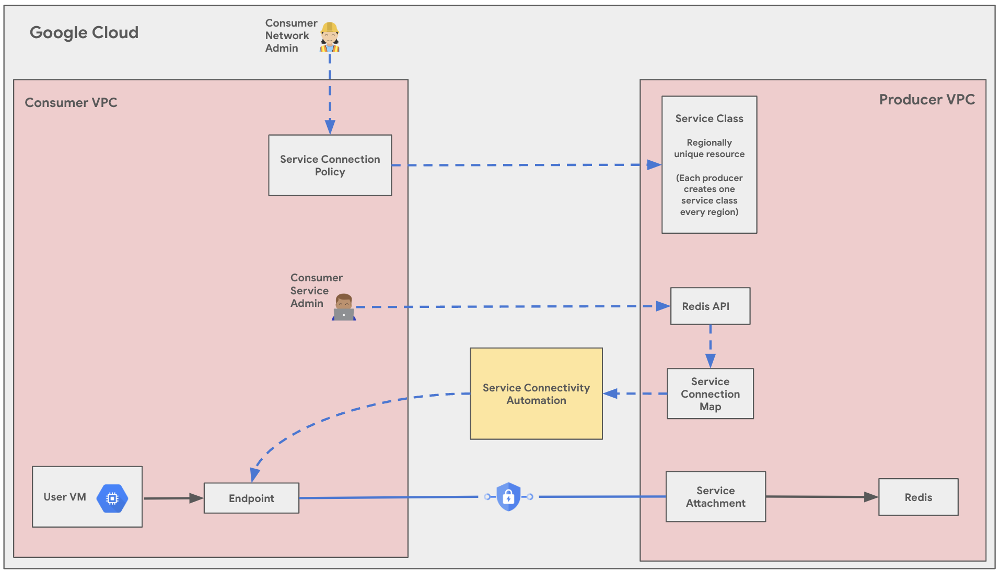

Create an MRC instance with Service Connection Policies accessed using Google Compute Engine  
---

Introduction  
---

*Simplified networking solution so you can spin up infrastructure in minutes using terraform\!*

Memorystore for Redis Clusters (MRC) are high-availability Redis clusters. We can use Private Service Connection \- [Service Connection Policies](https://cloud.google.com/vpc/docs/about-service-connection-policies) to set up networking for MRCs. Service Connection Policies automate the PSC Endpoint creation for PSC Network Setup. 

With this example, we streamline and simplify deployment of your Memorystore for Redis Clusters (MRC). We shall walk you through different stages of deployment to set up an entire infrastructure to run, manage and use MRC clusters in your GCP environment accessed using Google Compute Engine.

While going through each stage, please ensure that you have the necessary permissions required. The stages are : 

* Bootstrap stage : granting the required IAM permissions   
* Organization stage : enabling the required APIs  
* Networking stage : creating VPCs, subnets and Service Connectivity Policy  
* Security stage : securing environment using firewall rules  
* Producer stage : provisioning MRC instance  
* Networking Manual : **skipped**  
* Consumer stage : provisioning a Google Compute Engine instance

For each of the above mentioned stages, we shall walk you through the suggested variables for your environment.

Use Cases  
---

These are some of the use cases you can build on top of this infrastructure using Memorystore for Redis clusters :

* Caching for High-Traffic Web Applications  
* Real-Time Analytics and Data Processing  
* E-commerce Product Recommendations and Personalization  
* Financial Services Risk Management and Fraud Detection  
* Geospatial Applications and Location-Based Services

Architecture  
---



This solution will guide you how to establish a connection to an MRC instance with a Google Compute Engine in consumer VPC connecting to Memorystore for Redis Clusters through a Private Service Connect endpoint created using Service Connectivity automation, created during the MRC provisioning. The main components that are deployed in this architecture are the following : 

1. **Producer Service Class Project \[Google org\]**  
2. **Producer Project \[Google org\]**  
3. **Consumer Project \[Your org & project\]**  
4. **Service Class**  
5. **Consumer VPC & Subnet \[Your project\]**  
6. **Connection limit**

Prerequisites  
---

For the usage of this configuration solution, the following should be installed and properly configured: 

1. **Terraform** : the modules are meant for use with Terraform 1.3+ and tested using Terraform 1.3+. Choose and install the preferred Terraform binary from [here](https://releases.hashicorp.com/terraform/).

2. **gcloud SDK** : install gcloud SDK from [here](https://cloud.google.com/sdk/docs/install) to authenticate to Google Cloud while running Terraform.

Deploy  
---

Here’s a guide to configure tfvars for each stage and then use run.sh (/execution/run.sh) to automatically deploy the solution.

1. Navigate to the configuration/ directory and use the following tfvars for reference for in-place modifications. 

bootstrap.tfvars : 

* Add the following project IDs and user IDs/groups in the tfvars.

```c
bootstrap_project_id                  = "your-project-id"
network_hostproject_id                = "your-project-id"
network_serviceproject_id             = "your-project-id"
organization_stage_administrator      = ["user:user-example@example.com"]
networking_stage_administrator        = ["user:user-example@example.com"]
security_stage_administrator          = ["user:user-example@example.com"]
producer_stage_administrator          = ["user:user-example@example.com"]
networking_manual_stage_administrator = ["user:user-example@example.com"]
consumer_stage_administrator          = ["user:user-example@example.com"]

```

organisation.tfvars : 

* Add your project ID here in which you wish to enable the APIs for Memorystore for Redis Clusters.

```
activate_api_identities = {
  "project-01" = {
    project_id = "your-project-id",
    activate_apis = [
       "servicenetworking.googleapis.com",
       "iam.googleapis.com",
       "compute.googleapis.com",
       "redis.googleapis.com",
    ],
  },
}


```

networking.tfvars : 

* Add your project ID here in which you wish to create the VPC, Subnet and NAT for Memorystore for Redis Clusters.

```c

project_id = "your-project-id"

region     = "us-west1"

## VPC input variables

network_name = "CNCS_VPC"
subnets = [
  {
    ip_cidr_range = "10.0.0.0/24"
    name          = "CNCS_VPC_Subnet_1"
    region        = "us-west1-a"
  }
]

# PSC/Service Connecitvity Variables

create_scp_policy      = true
subnets_for_scp_policy = ["CNCS_VPC_Subnet_1"]

## Cloud Nat input variables

create_nat = true

## Cloud HA VPN input variables

create_havpn = false

```

**NOTE : Before moving forward, please delete the security/alloydb.tfvars and security/cloudsql.tfvars files as our CUJ only involves MRC and GCE.**

security/gce.tfvars : 

* Use the same project ID as used above for enabling APIs and creation of networking resources. This stage should create the necessary firewall rules for GCE security.

```
project_id = "your-project-id"

name = "CNCS_VPC"
ingress_rules = [
  {
    name        = "allow-ssh-custom-ranges"
    description = "Allow SSH access from specific networks"
    priority    = 1000
    source_ranges = [
      "", # Source ranges such as "192.168.1.0/24" or "10.0.0.0/8"
    ]
    target_tags = ["ssh-allowed", "https-allowed"]
    allow = [{
      protocol = "tcp"
      ports    = ["22", "443"]
    }]
  }
]
```

security/mrc.tfvars : 

* Use the same project ID as used above for enabling APIs and creation of networking resources. This stage should create the necessary firewall rules for MRC security.

```c

project_id = "your-project-id"

network    = "CNCS_VPC"
egress_rules = {
  allow-egress-mrc = {
    deny = false
    rules = [{
      protocol = "tcp"
      ports    = ["6379"]
    }]
  }
}

```

execution/04-producer/MRC/config/instance1.yaml : 

* Use the same project ID as used above for the creation of the Memorystore for Redis Clusters instance.

```c

project_id: your-project-id

redis_cluster_name: CNCS-Redis-Cluster
shard_count: 3
network_id: projects/$project-id/global/networks/CNCS_VPC
region: us-west1
replica_count: 1

```

execution/06-consumer/GCE/configs/instance1.yaml : 

* Use the same project ID as used above for the creation of the Google Compute Engine instance.

```c
project_id: your-project-id

name: CNCS-GCE
region : us-west1
zone: us-west1-a
image: ubuntu-os-cloud/ubuntu-2204-lts
network: projects/your-project-id/global/networks/CNCS_VPC
subnetwork: projects/your-project-id/regions/us-west11/subnetworks/CNCS_VPC_Subnet_1
```

2. Now, navigate to the execution/ directory and run this command to run the automatic deployment using run.sh (/execution/run.sh) : 

```c
sh run.sh -s all -t init-apply
```

Here, \-s flag with all values will run all **s**tages and \-t flag with value init-apply will ask **t**erraform to use init and apply steps.

Usage  
---

Once your deployment is complete, you can SSH to your Google Compute Engine instance. Use this [guide](https://cloud.google.com/compute/docs/connect/standard-ssh) if required. Now, to connect to your newly created Memorystore for Redis Clusters instance : 

1. To view the Cluster Endpoint to connect to, run this command : 

```c
gcloud redis clusters describe CNCS-Redis-Instance
--region=us-west1
```

2. Once you’ve the endpoint,  SSH to your compute instance : 

```c
gcloud compute ssh CNCS-GCE --zone us-west1-a --region us-west1
```

   

3. Once you’re connected to the Compute Engine instance, send PING to the Memorystore for Redis Clusters instance to test the connectivity using this [command](https://cloud.google.com/memorystore/docs/cluster/connect-cluster-instance#gcloud) : 

 

```c
redis-cli -h ENDPOINT_IP_FROM_STEP_1 -p 6379 -c
```

Cleaning Up  
---

Once you’re done with using the environment, you can destroy the resources using the run.sh (/execution/run.sh)automated script with this command from parent folder : 

```c
sh run.sh -s all -t destroy
```

Before destroying, ensure that if you’d any critical data/applications you’ve safely moved them.

Known Issues  
---

No known issues for this example at the moment, however if you run into any issues please feel free to create an issue/bug in this repository.

Submit feedback
---

To troubleshoot errors, check Terraform's logs and output.

To submit feedback, do the following:

* If you're looking for assistance with streamlining network configuration automation for a comparable use case, feel free to submit an issue on the [GitHub repository](https://github.com/GoogleCloudPlatform/cloudnetworking-config-solutions/issues).
* For unmodified Terraform code, create issues in the [GitHub repository](https://github.com/GoogleCloudPlatform/cloudnetworking-config-solutions/issues). GitHub issues are reviewed on a best-effort basis and are not intended for general use questions.
* For issues with the products that are used in the solution, contact [Cloud Customer Care](https://cloud.google.com/support-hub).